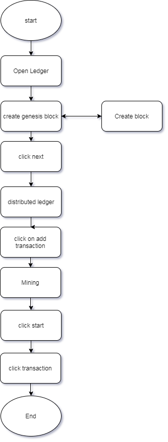
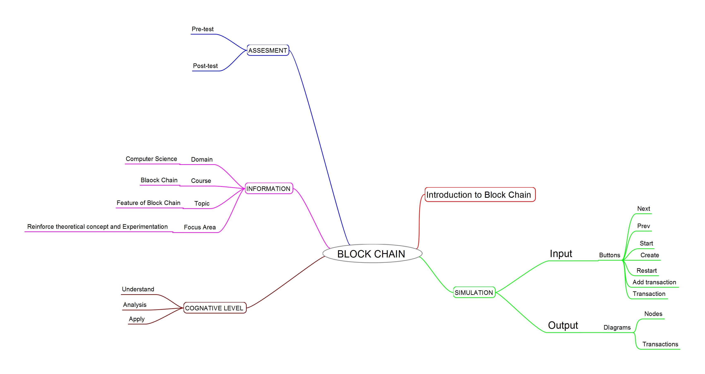
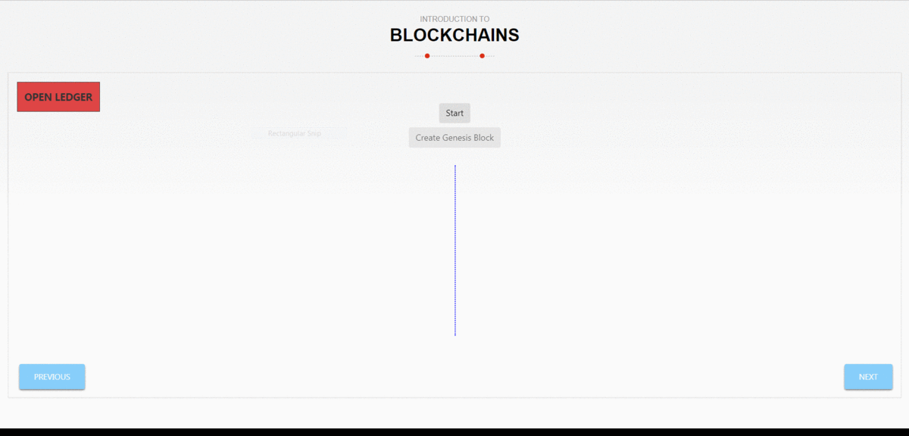

## Round 2

Experiment 1: Introduction to Block Chain

### 1. Story Outline:

 The students lands into the simulator and it demonstrates the following scenario. Initially there is a concept of open ledger followed by distributed ledger and at the end there is a mining concept.

### 2. Story:

The experiment demonstrates three main concepts of Blockchain namely open ledger ditributed ledger and mining the creation of Blockchain is depicted by showing transactions in the open ledges component of distributed ledger is depicted in. Second phase where it is shown how a valid transaction is ditributed among all users and the last phases of the mining that validate all transactions with the help of hashing concept.

#### 2.1 Set the Visual Stage Description:
<h2>Construction of the set-up:</h2>

For better visualization a simulator is provided. There is a need of physical significance for teaching Blockchain. Since performing this experiment in real life is not feasible because of privacy issues, a simulator can always be the best alternative. A proper animated environemnt is given for understanding the procedure. Three user control functions are namely(Open Ledger,Distributed Ledger and Mining) perform one by one for deeper understadning of the concept. 
 
#### 2.2 Set User Objectives & Goals:
Sr. No |	Learning Objective	| Cognitive Level | Action Verb
:--|:--|:--|:-:
1.| User will be able to:  Understand the concept of blockchain    and how it is applied. | Understand | Describe
2.| User will be able to:  Understand what is a open ledger and it's creation | Understand| Describe
3.| User will be able to:  Apply the concept of open ledger to create  an open ledger | Apply | Experiment with Apply
4.| User will be able to:  To analyze how mining works in validating   an unchecked transaction by  hashing | Analyze| Examine

Enhance conceptual and logical skill
</b>

#### 2.3 Set the Pathway Activities:

The simulator tab would allow:   
<dd>1.	To make transaction from users that will create unvalidated blocks. 
2.	The block will further get linked showing the 'chain' of blockchain. 
3.	There would be a ‘Start’ button which will start the processes in first and last part. 
4.	Student can also read the instructions on the side for further explanation of what is happening. 
5.	Second part is for analyzing distributed ledger. 
6.  Third part is showing us how mining works and the process of validation of transaction.
</dd>

##### 2.4 Set Challenges and Questions/Complexity/Variations in Questions:

Assessment Questions: 
Task 1: Understanding the open Ledger 

<dd><b> Which of these statements are true for open ledger:- 
a)	Every one has copy of ledger. 
b)	Ledger can be viewed by anyone. 
c)	Ledger is mutable. 
d)	None Of these </dd> </b>
Task 2 : To understand how ledger is distributed among all members to prevent mutability  
<dd><b>1.Which of the following  is true for distributed ledger. 
a)	Everyone has a copy of ledger
 
b)	THere is one copy of the ledger
 
c)	Ledger is mutable.
 
d)	None of these
  </b>
</dd>

Task 3 : To analyze the mining process  
<dd>
<b> A miner has completed the minning what will be the next step:- 
a)	Wait for second miner to complete 
b)	Wait for all members to complete 
c)	Validate the transaction and add it to the ledger 
d)	None of the above  </b>
</dd>

##### 2.5 Conclusion:
<dd>In this experiment user has learn't about the 3 main features of block chain. 
</dd>

##### 2.6 Equations/formulas: NA

### 3. Flowchart

### 4. Mindmap

 
### 5. Storyboard 

